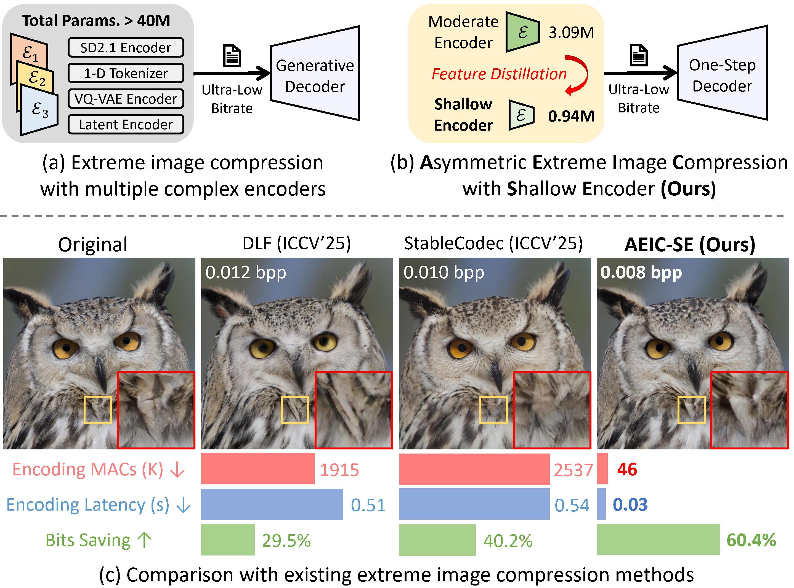

## Ultra-Low Bitrate Perceptual Image Compression with Shallow Encoder

**_Asymmetric Extreme Image Codec for Real-Time Encoding!_**

Tianyu Zhang, Dong Liu, Chang Wen Chen

University of Science and Technology of China, The Hong Kong Polytechnic University

&nbsp;
&nbsp;

> Ultra-low bitrate image compression (below 0.05 bits per pixel) is increasingly critical for bandwidth-constrained and computation-limited encoding scenarios such as edge devices. Existing frameworks typically rely on large pretrained encoders (e.g., VAEs or tokenizer-based models) and perform transform coding within their generative latent space. While these approaches achieve impressive perceptual fidelity, their reliance on heavy encoder networks makes them unsuitable for deployment on weak sender devices. In this work, we explore the feasibility of applying shallow encoders for ultra-low bitrate compression and propose a novel **A**symmetric **E**xtreme **I**mage **C**ompression (**AEIC**) framework that pursues simultaneously encoding simplicity and decoding quality. Specifically, AEIC employs moderate or even shallow encoder networks, while leveraging an one-step diffusion decoder to maintain high-fidelity and high-realism reconstructions under extreme bitrates. To further enhance the efficiency of shallow encoders, we design a dual-side feature distillation scheme that transfers knowledge from AEIC with moderate encoders to its shallow encoder variants. Experiments demonstrate that **AEIC not only outperforms existing methods on rate-distortion-perception performance at ultra-low bitrates, but also delivers exceptional encoding efficiency for 35.8 FPS on 1080P input images, while maintaining competitive decoding speed compared to existing methods.**

