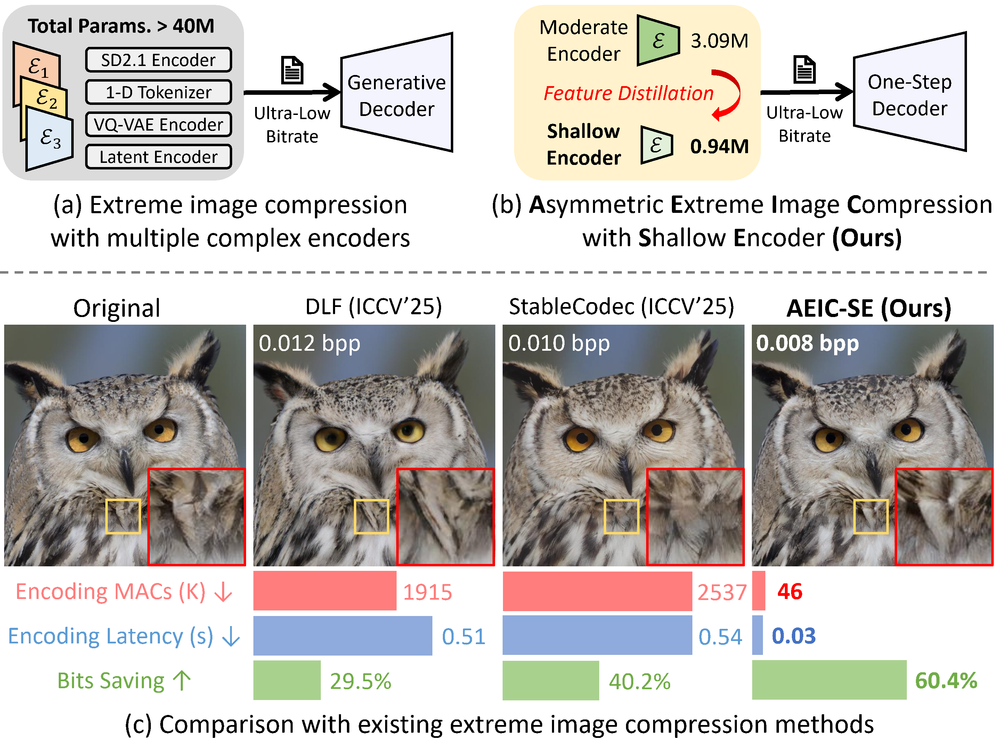
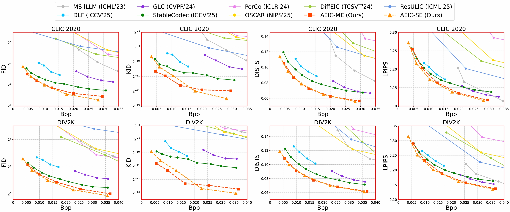
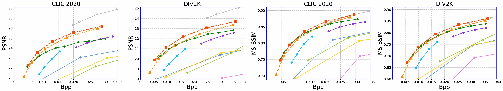
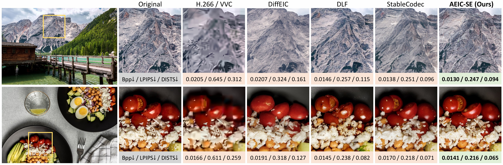
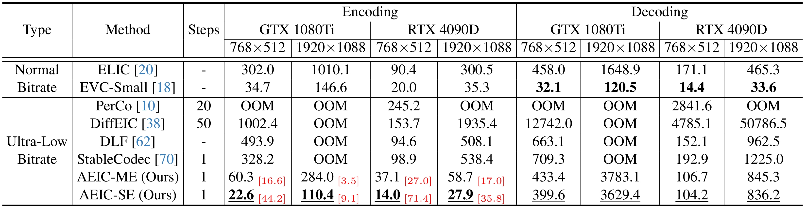
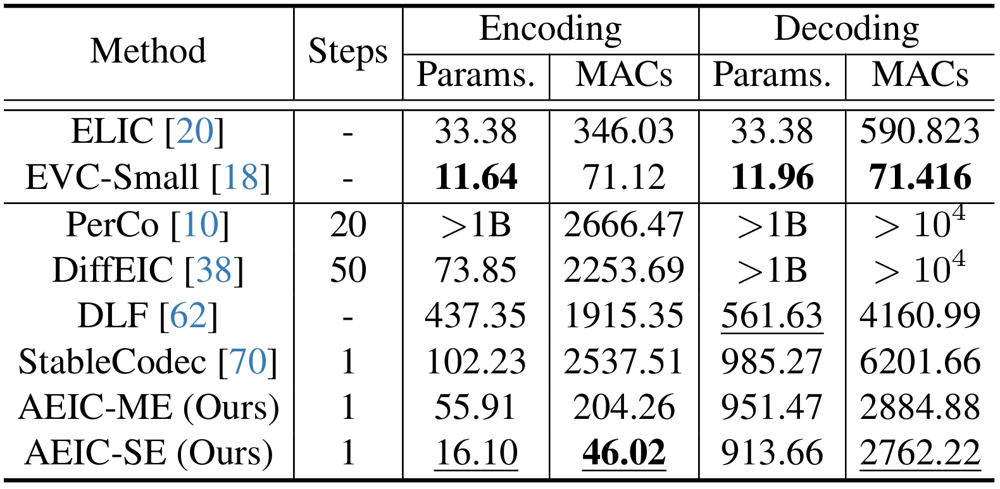

<div align="center">

## Ultra-Low Bitrate Perceptual Image Compression with Shallow Encoder

**_Asymmetric Extreme Image Codec for Real-Time Encoding!_**

Tianyu Zhang, Dong Liu, Chang Wen Chen

University of Science and Technology of China, The Hong Kong Polytechnic University

[](https://arxiv.org/pdf/2512.12229)&nbsp;
&nbsp;

</div>

<p align="center"></p>

>   

## 📝 Overview
1. Ultra-low bitrate image compression (<0.05bpp) is increasingly critical for bandwidth-constrained and computation-limited encoding scenarios such as edge devices.
2. We show that **ultra-low bitrate allows for shallow encoders** and propose **A**symmetric **E**xtreme **I**mage **C**ompression (**AEIC**) framework that **pursues simultaneously encoding simplicity and decoding quality**. Specifically, AEIC:
   - Outperforms advanced methods in terms of rate-distortion-perception performance.
   - Delivers **exceptional encoding efficiency for 35.8 FPS@1080P**
   - Maintains competitive decoding speed compared to existing methods.

## :hourglass: Updates
**[2026/03/11] Release pretrained checkpoints for inference.**  
[2026/03/10] Results on benchmarks are now available, see `results/`.   
[2026/02/26] Initial release of this repo.     


## 😍 Performance
1. **Rate-Perception performance:**  
   <p align="center"></p>
   <p></p>
2. **Rate-Distortion performance:**
   <p align="center"></p>
   <p></p>
3. **Visual performance:**
   <p align="center"></p>
   <p></p>
4. **Practical coding latency (ms)** on two kinds of GPUs and image resolutions. Both the encoding and decoding process include the autoregressive entropy coding with the entropy model. The best results are highlighted in **bold**, while the best results among ultra-low bitrate codec are <ins>underlined</ins>. "OOM" means out of memory. We also report the 🔴 **[encoding FPS]** for AEIC models:
   <p align="center"></p>
   <p></p>
5. **Complexity** in parameters (M) and MACs (K) per pixel:
   <p align="center"></p>

## ⚙ Installation

```
conda create -n aeic python=3.10
conda activate aeic
pip install -r requirements.txt
```  

## ⚡ Inference

**Step 1: Prepare your datasets for inference**
```
<PATH_TO_DATASET>/*.png
```
In our paper, we adopt the following test datasets: 
- [Kodak](https://r0k.us/graphics/kodak/): Contains 24 natural images with 512x768 pixels.
- [DIV2K Validation Set](https://data.vision.ee.ethz.ch/cvl/DIV2K/): Contains 100 2K-resolution images.
- [CLIC 2020 Test Set](https://archive.compression.cc/challenge/): Contains 428 2K-resolution images.

**Step 2: Download pretrained checkpoints**

1. Download [SD-Turbo](https://huggingface.co/stabilityai/sd-turbo) and [VAE Decoder](https://huggingface.co/Guaishou74851/AdcSR/resolve/main/weight/pretrained/halfDecoder.ckpt) from Hugging Face.
2. Download [AEIC checkpoints](https://drive.google.com/drive/folders/1vioCW4EIxQiuLkWHKj7xbMi7WAVcWqJI?usp=drive_link). We provide 2 variants:
   - AEIC-ME: Moderate encoder variants.
   - AEIC-SE: Shallow encoder variants for real-time encoding.

**Step 3: Build the entropy coding engine**

```bash
sudo apt-get install cmake g++
cd src
mkdir build
cd build
cmake ../cpp -DCMAKE_BUILD_TYPE=Release[Debug]
make -j
```

**Step 4: Inference AEIC models**

Please modify the paths in `compress.sh`, then run `bash compress.sh`: 
```bash
python /src/compress.py \
    --sd_path="<PATH_TO_SD_TURBO>/sd-turbo" \
    --img_path="<PATH_TO_DATASET>/Kodak" \
    --rec_path="<PATH_TO_SAVE_OUTPUTS>/rec" \
    --bin_path="<PATH_TO_SAVE_OUTPUTS>/bin" \
    --codec_type="AEIC-SE" \ # Or AEIC-ME
    --codec_path="<PATH_TO_AEIC>/AEIC_SE_ft2.pkl" \
    --vae_decoder_path="<PATH_TO_VAE_DECODER>/halfDecoder.ckpt" \
    # --use_practical_entropy_coding
```
Notes:

- The default inference settings enable `--use_tiled_vae` and `--use_tiled_unet` for the best reconstruction performance. For fast decoding, please consider disabling tiling options in `src/my_utils/testing_utils`.
- To produce practical bitstreams with entropy coder, please enable `--use_practical_entropy_coding` .


**Step 5: Evaluation (Optional)**

Run `bash eval_folders.sh` to compute reconstruction metrics with `src/evaluate.py`. Please make sure `--recon_dir` and `--gt_dir` are specified:

```bash
python src/evaluate.py \  
    --gt_dir="<PATH_TO_DATASET>/Kodak/" \  
    --recon_dir="<PATH_TO_SAVE_OUTPUTS>/rec/"
```


## :book: Citation

If you find this work helpful, please consider citing us. Thanks! 🥰
```bibtex
@article{zhang2025ultra,
  title={Ultra-Low Bitrate Perceptual Image Compression with Shallow Encoder},
  author={Zhang, Tianyu and Liu, Dong and Chen, Chang Wen},
  journal={arXiv preprint arXiv:2512.12229},
  year={2025}
}
```
```bibtex
@InProceedings{Zhang_2025_ICCV,
    author    = {Zhang, Tianyu and Luo, Xin and Li, Li and Liu, Dong},
    title     = {StableCodec: Taming One-Step Diffusion for Extreme Image Compression},
    booktitle = {Proceedings of the IEEE/CVF International Conference on Computer Vision (ICCV)},
    month     = {October},
    year      = {2025},
    pages     = {17379-17389}
}
```


## :notebook: License

This work is licensed under MIT license.


## 🥰 Acknowledgement

This work is implemented based on [StableCodec](https://github.com/LuizScarlet/StableCodec). During development, we draw inspiration primarily from [shallow-ntc](https://github.com/mandt-lab/shallow-ntc), [AdcSR](https://github.com/Guaishou74851/AdcSR) and [PocketSR](https://arxiv.org/pdf/2510.03012). Thanks for their great work!


## :envelope: Contact

If you have any questions, please feel free to drop me an email: 


- zhangtianyu[at]mail.ustc.edu.cn


